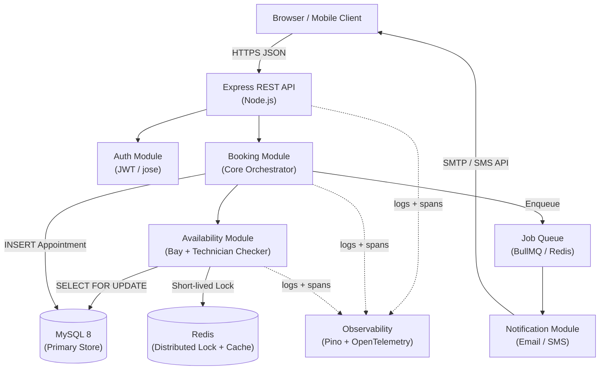

# Appointment Scheduler — Architecture Design

## Requirements

### Functional

- A customer can request a service appointment by specifying: vehicle, service type, dealership, and desired time slot.
- The system checks real-time availability of a **ServiceBay** and a **qualified Technician** for the full service duration before confirming.
- On success, a persistent **Appointment** record is created, associating the customer, vehicle, technician, and service bay.
- Customers receive a confirmation (email/notification) after booking.

### Non-Functional

- **Performance**: Availability check + booking < 500 ms p95.
- **Reliability**: No double-bookings under concurrent requests (race-condition safe).
- **Scalability**: Horizontally scalable API; database handles growth via indexing and connection pooling.
- **Maintainability**: Clear module boundaries, typed interfaces, and documented decisions.
- **Observability**: Structured logging, key metrics, and distributed tracing across the booking flow.

---

## Architecture: Modular Monolith

A **Modular Monolith** is chosen over microservices. For this scale and team size, splitting into multiple services adds deployment, networking, and distributed-transaction overhead with no meaningful benefit. Each module has a strict, narrow public interface so it can be extracted later if genuine scale demands it.



---

## Component Descriptions

| Component | Role |
|-----------|------|
| **Express REST API** | HTTP entry point. Validates request body/params with Zod middleware, attaches auth context, delegates to the Booking module. Returns structured JSON responses. Express Router groups enforce module boundaries at the route level. |
| **Auth Module** | Issues and verifies JWTs using the `jose` library. Implemented as an Express middleware that resolves the customer identity and sets it on `req.user`. |
| **Booking Module** | Core orchestrator. Calls Availability, opens a database transaction, writes the Appointment record, and enqueues the confirmation job. Single unit of business logic — keeps availability check and record creation atomic. |
| **Availability Module** | Queries `service_bays` and `technicians` against existing `appointments` for the requested `[start_time, end_time)` window. Uses a `SELECT … FOR UPDATE` database lock (or a Redis distributed lock as a fast pre-screen) to prevent concurrent over-booking. |
| **Notification Module** | Consumes jobs from the BullMQ queue and dispatches confirmation emails (Resend/SendGrid) or SMS (Twilio). Decoupled so a slow SMTP call never blocks the booking response. |
| **MySQL 8** | Single source of truth for all entities. ACID transactions (InnoDB engine) guarantee no double-bookings survive to disk. `SELECT FOR UPDATE SKIP LOCKED` is supported natively from MySQL 8.0. |
| **Redis** | Two roles: (1) distributed lock guard for availability checks under high concurrency; (2) BullMQ job queue backing store. |
| **Observability Stack** | Pino for structured JSON logs; OpenTelemetry SDK for traces; Prometheus-compatible metrics endpoint. |

---

## Data Flow

### Happy Path — Booking an Appointment

```
1. Customer submits POST /appointments
   { vehicleId, serviceTypeId, dealershipId, desiredStartTime }

2. Express Route Handler
   └─ Validates payload schema (Zod middleware)
   └─ Authenticates JWT → resolves customerId

3. Booking Module opens a DB transaction
   │
   ├─ 3a. Availability Module
   │       SELECT id FROM service_bays
   │         WHERE dealership_id = ? AND id NOT IN (
   │           SELECT service_bay_id FROM appointments
   │           WHERE time range overlaps AND status != 'cancelled'
   │         ) LIMIT 1 FOR UPDATE SKIP LOCKED
   │
   │       SELECT id FROM technicians
   │         WHERE dealership_id = ? AND skill includes serviceType
   │         AND id NOT IN (
   │           SELECT technician_id FROM appointments
   │           WHERE time range overlaps AND status != 'cancelled'
   │         ) LIMIT 1 FOR UPDATE SKIP LOCKED
   │
   │       Returns: { bayId, technicianId } or throws NoAvailabilityError
   │
   ├─ 3b. Booking Module
   │       INSERT INTO appointments (customer_id, vehicle_id, service_type_id,
   │         technician_id, service_bay_id, start_time, end_time, status='confirmed')
   │
   └─ COMMIT

4. Enqueue notification job (fire-and-forget, outside transaction)

5. Return 201 Created { appointmentId, confirmedStartTime, technicianName, bayNumber }

6. Notification Worker picks up job → sends confirmation email
```

### Conflict Path — No Resources Available

```
3a. Availability Module finds no free bay or no qualified technician
    └─ Throws NoAvailabilityError
3.  Transaction is rolled back (nothing written)
5.  API returns 409 Conflict { message: "No availability for requested time" }
```

---

## Database Schema (Simplified)

```sql
-- Core entities
customers       (id CHAR(36) PK, name, email, phone)
vehicles        (id, customer_id, make, model, year, license_plate)
dealerships     (id, name, address)
service_types   (id, name, duration_minutes, required_skill)

-- Resources
service_bays    (id, dealership_id, bay_number, is_active TINYINT(1))
technicians     (id, dealership_id, name, skills JSON)

-- Booking record
appointments    (
  id              CHAR(36) PRIMARY KEY,       -- UUID stored as string
  customer_id     FK → customers,
  vehicle_id      FK → vehicles,
  service_type_id FK → service_types,
  technician_id   FK → technicians,
  service_bay_id  FK → service_bays,
  dealership_id   FK → dealerships,
  start_time      DATETIME NOT NULL,          -- stored in UTC
  end_time        DATETIME NOT NULL,
  status          ENUM('pending','confirmed','cancelled','completed'),
  created_at      DATETIME DEFAULT CURRENT_TIMESTAMP
)

-- Indexes for availability queries
CREATE INDEX idx_appt_bay_time    ON appointments(service_bay_id, start_time, end_time);
CREATE INDEX idx_appt_tech_time   ON appointments(technician_id,  start_time, end_time);
CREATE INDEX idx_appt_dealership  ON appointments(dealership_id,  status);
```

---

## Technology Choices

| Technology | Justification |
|------------|---------------|
| **Node.js + Express** | Ubiquitous, battle-tested HTTP framework with the largest ecosystem and middleware library. Familiar to virtually every Node.js developer; zero learning curve, simple Router-based module separation. |
| **TypeScript** | Compile-time safety across the shared domain model (entities, DTOs). Essential for maintainability. |
| **MySQL 8 (InnoDB)** | ACID transactions are non-negotiable for preventing double-bookings. `SELECT FOR UPDATE SKIP LOCKED` is supported natively from MySQL 8.0. Widely deployed, fully supported by Prisma. |
| **Prisma ORM** | Type-safe query builder, schema-as-code migrations, integrates cleanly with TypeScript. |
| **Redis + BullMQ** | Redis acts as both a fast distributed lock store and the durable job queue. BullMQ provides retries and dead-letter queues for reliable notification delivery. |
| **Zod** | Runtime input validation at the API boundary — prevents injection and malformed data at the entry point. Used as Express middleware via a thin wrapper that calls `schema.parse()` on `req.body` / `req.params`. |
| **jose** | Standards-compliant JWT signing/verification (RFC 7519). Pure JS, no native dependencies, straightforward to audit. |
| **Pino** | Structured JSON logs with minimal overhead. Easily piped to any log aggregator (Datadog, Loki, CloudWatch). |
| **OpenTelemetry SDK** | Vendor-neutral tracing. Instruments HTTP, DB, and queue spans automatically; exportable to Jaeger, Tempo, or any OTLP backend. |
| **Resend / SendGrid** | Managed transactional email delivery — no SMTP server to operate. |

---

## Observability Strategy

### Logging (Pino)

- All logs are **structured JSON** with consistent fields: `traceId`, `userId`, `dealershipId`, `level`, `msg`, `durationMs`.
- Key log events:
  - `booking.requested` — captures input (no PII beyond IDs)
  - `availability.checked` — records `bayId`, `technicianId`, or `noAvailability`
  - `appointment.created` — records `appointmentId`, `startTime`
  - `notification.enqueued` / `notification.sent`
  - `error.*` — always logs full stack trace + context

### Metrics (Prometheus-compatible via `prom-client`)

| Metric | Type | Why |
|--------|------|-----|
| `booking_requests_total{status}` | Counter | Track success vs. conflict rates |
| `availability_check_duration_ms` | Histogram | Detect slow DB queries |
| `booking_duration_ms` | Histogram | End-to-end booking latency |
| `notification_queue_depth` | Gauge | Alert on queue back-pressure |
| `db_connection_pool_utilization` | Gauge | Detect pool exhaustion early |

### Tracing (OpenTelemetry)

- A **trace spans the entire booking request**: HTTP → Booking Module → Availability Module → DB transaction → Queue enqueue.
- This lets you answer: "Why did this booking take 800 ms?" without grepping logs.
- Spans carry `dealership_id`, `service_type_id`, and `appointment_id` as attributes.

### Alerting (simple rules)

- `booking_requests_total{status="error"}` rate > 5% → page on-call.
- `availability_check_duration_ms` p95 > 1 s → investigate slow queries.
- `notification_queue_depth` > 500 → potential notification outage.

---

## Architecture Decision Records

### ADR-001: Modular Monolith over Microservices

**Status:** Accepted

**Context:** The core booking flow requires an atomic check-and-book operation across two resources (bay + technician). In a microservice topology, this would require a distributed transaction or saga pattern — significant operational and code complexity for an assignment-scale system.

**Decision:** Package the system as a single deployable with well-defined internal module boundaries (`BookingModule`, `AvailabilityModule`, `NotificationModule`).

**Consequences:**

- Positive: Single deployment, no network hops between modules, simple local transactions.
- Positive: Teams can still iterate on modules independently via encapsulated interfaces.
- Negative: All modules scale together (acceptable at this scale).
- Negative: A bug in one module can affect the process (mitigated by module isolation patterns).

**Alternatives:** Microservices with saga pattern — rejected; too much complexity for this scope.

---

### ADR-002: MySQL 8 `SELECT FOR UPDATE SKIP LOCKED` for Concurrency Control

**Status:** Accepted

**Context:** Two concurrent booking requests for the same time slot could both pass the availability check and then both write, causing a double-booking. A naive check-then-insert pattern is not safe.

**Decision:** Wrap the availability check and appointment insert in a single InnoDB transaction. Use `SELECT … FOR UPDATE SKIP LOCKED` on the bay and technician rows so competing transactions lock different rows rather than blocking each other. MySQL 8.0+ supports `SKIP LOCKED` natively.

**Consequences:**

- Positive: Atomicity guaranteed at the database level — no application-level locking code needed.
- Positive: `SKIP LOCKED` means concurrent requests for *different* resources proceed without waiting.
- Negative: Slightly more complex SQL queries (handled by Prisma raw queries for the lock clause).
- Negative: Long-running transactions increase lock contention — mitigated by keeping the transaction tight (availability check + insert only, no I/O inside).

**Alternatives:** Optimistic locking with version columns — rejected; requires a retry loop in application code and more complex error handling.

---

### ADR-003: Async Notification via Job Queue

**Status:** Accepted

**Context:** Sending confirmation email/SMS involves an external HTTP call (50–500 ms). Blocking the booking response on this call degrades perceived performance and couples booking reliability to notification provider uptime.

**Decision:** After the appointment is committed, enqueue a job in BullMQ. The booking API responds immediately with `201 Created`. A separate worker process handles delivery with automatic retries.

**Consequences:**

- Positive: Booking response time is not affected by email provider latency.
- Positive: Failed notifications are retried automatically without user impact.
- Negative: Notification is eventually (not immediately) consistent — acceptable; confirmation arrives within seconds.

---

## Risks and Mitigations

| Risk | Likelihood | Impact | Mitigation |
|------|-----------|--------|------------|
| Database connection pool exhaustion under load | Medium | High | Configure Prisma `connection_limit`; monitor `db_connection_pool_utilization` metric |
| Notification delivery failure | Medium | Low | BullMQ dead-letter queue; retry up to 5 times with exponential backoff |
| Redis unavailability | Low | Medium | Redis is non-critical path (locks are advisory pre-screen); DB transaction is the true safety net |
| Time zone handling errors in scheduling | High | High | Store all times as `DATETIME` in UTC (set `timezone: 'Z'` in Prisma datasource); convert to local time only in the UI layer |
| Input injection via booking fields | Medium | High | Zod schema validation at API boundary; Prisma parameterised queries (no raw string interpolation) |
